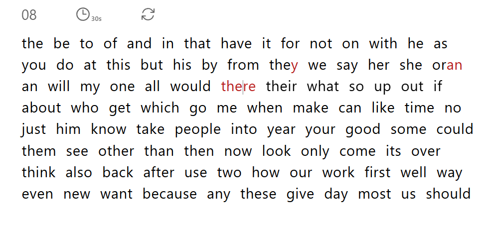

# Typik (v1)

_Minimal typing trainer for speed & accuracy_

**Typik** is a lightweight typing practice web app built with **Next.js**, **Tailwind CSS** and **Zustand**.  
It focuses on clean visuals, instant feedback and a distraction-free environment to help you type faster and more accurately.

<p align="start">
  
</p>

---

## Features

- **Real-time WPM counter** - updates as you type
- **Simple word flow** - practice common English words for rhythm and muscle memory
- **30-second timed sessions**
- **Instant restart** to keep your focus
- **Clean, minimal UI** with no clutter

## Tech Stack

- **Next.js 14**
- **React 18**
- **Tailwind 3**
- **Zustand**
- **Headless UI**

## Getting Started

#### Requirements

- Node .js v18 +
- npm / yarn / pnpm

#### Setup

```bash
# clone
git clone https://github.com/bryanlzl/typik-v1.git
cd typik-v1
```

```bash
# install deps
npm install
```

```bash
# run dev server
npm run dev
```

Go to **http://localhost:3000** to start typing.

## Scripts

| Command         | Description             |
| --------------- | ----------------------- |
| `npm run dev`   | Start local dev server  |
| `npm run build` | Build production bundle |
| `npm run start` | Serve production build  |
| `npm run lint`  | Run ESLint checks       |

## Future Plans

- configurable timer & word sets
- results history & accuracy graph
- dark / light theme toggle
- leaderboard integration

## Author

[@bryanlzl](https://github.com/bryanlzl)
